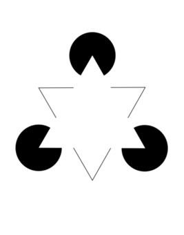
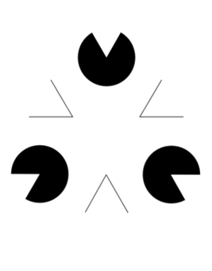
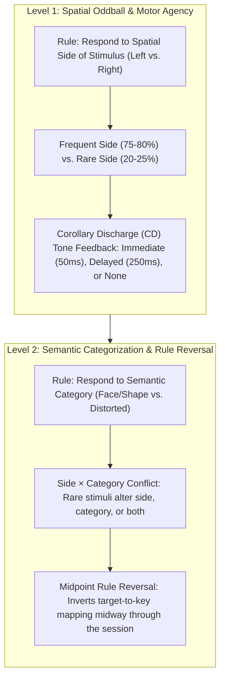
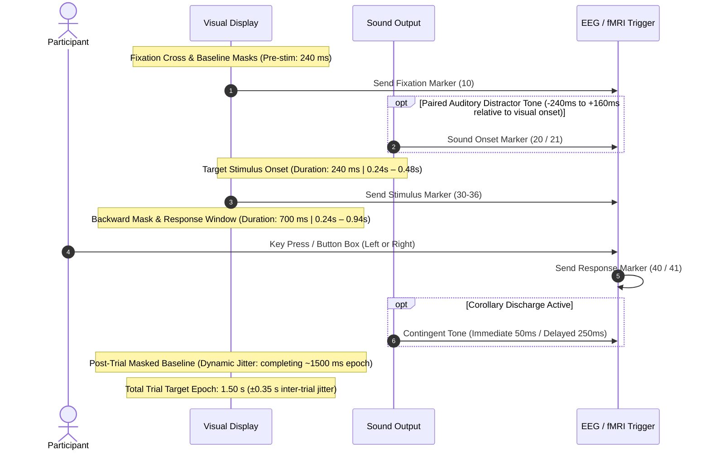
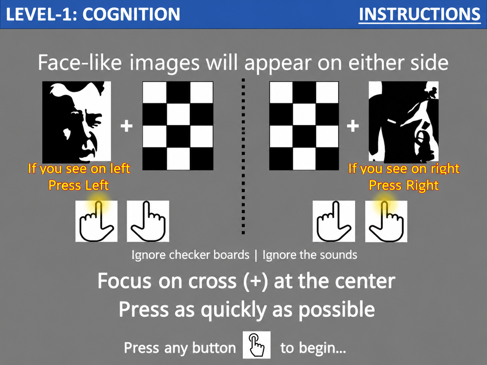

# ANGEL: Assessing Neurocognition via Gamified Experimental Logic (PsychoPy Recreation)

<p align="center">
  
</p>

<p align="center">
  Developed by the <b>Team from Centre for Consciousness Studies (CCS)</b>,<br>
  Department of Neurophysiology,<br>
  <b>National Institute of Mental Health and Neurosciences (NIMHANS)</b>, Bangalore, India.
</p>

<p align="center">
  <a href="https://www.frontiersin.org/journals/neuroscience/articles/10.3389/fnins.2016.00001/full"></a>
  <a href="https://www.psychopy.org"></a>
  <a href="https://github.com/sccn/labstreaminglayer"></a>
  <a href="https://bids.neuroimaging.io"></a>
</p>

---

## 📖 Scientific Background

The **ANGEL (Assessing Neurocognition via Gamified Experimental Logic)** paradigm is an advanced cognitive neuroscience protocol designed to simultaneously assess multiple neurocognitive domains and elicit distinct Event-Related Potential (ERP) components within a single, unified experimental session.

> **Primary Reference:**  
> Nair AK, Sasidharan A, John JP, Mehrotra S, Kutty BM (2016). *Assessing Neurocognition via Gamified Experimental Logic: A Novel Approach to Simultaneous Acquisition of Multiple ERPs.* **Frontiers in Neuroscience**, 10:1.  
> [https://doi.org/10.3389/fnins.2016.00001](https://www.frontiersin.org/journals/neuroscience/articles/10.3389/fnins.2016.00001/full)

### Multi-ERP Co-registration within a Single Protocol

Traditional ERP paradigms evaluate one cognitive process at a time (e.g., standard oddball for P300, flanker for ERN, or tone-pairs for MMN), requiring lengthy recording protocols that suffer from participant fatigue and non-stationarity. ANGEL multiplexes multiple cognitive challenges into a structured trial flow:

| Neural Component | Cognitive Domain | Paradigm Manipulation |
| :--- | :--- | :--- |
| **N170 / N1** | Early Visual Structural Encoding | Mooney Face vs. Kanizsa Illusory Shape vs. Distorted Stimuli |
| **Visual P300 (P3b)** | Visual Context Updating / Oddball Target Detection | Infrequent (20%) vs. Frequent (80%) visual targets |
| **Auditory MMN / P3a** | Preattentive Auditory Deviance Processing | Standard (80%) vs. Deviant (20%) auditory distractor tones |
| **LRP (Lateralized Readiness Potential)** | Motor Preparation & Execution | Left-hand vs. Right-hand motor responses |
| **ERN / Pe (Error-Related Negativity)** | Performance Monitoring & Error Processing | Speeded responses and rule-reversal conflicts |
| **Corollary Discharge (CD) Suppression** | Self-Monitoring & Agency Verification | Contingent auditory tones (immediate, delayed, or absent) |

---

## 🖼️ Stimulus Sets & Visual Features

ANGEL uses standardized, high-contrast visual stimuli presented with backward checkerboard masking to ensure precise perceptual onset and offset:

| Stimulus Type | Meaningful / Target (Face/Shape Present) | Distorted / Non-Target (Face/Shape Absent) | Mask / Fixation |
| :---: | :---: | :---: | :---: |
| **Mooney Faces** | <br>*(Meaningful Face)* | <br>*(Distorted Face)* | <br>*(Checkerboard Mask)* |
| **Kanizsa Triangles** | <br>*(Illusory Shape)* | <br>*(Distorted Shape)* | <br>*(Central Fixation)* |

---

## 🎯 Paradigm Architecture & Levels

The experiment is structured into distinct, hierarchically complex cognitive levels:



### Level 1: Spatial Rule & Corollary Discharge
- **Primary Task**: Spatial response according to stimulus side (e.g., Left side stimulus $\rightarrow$ Left key, Right side stimulus $\rightarrow$ Right key) irrespective of image category.
- **Visual Oddball Balance**: 75–80% frequent side, 20–25% rare side.
- **Corollary Discharge Schedule**: Button presses trigger an auditory feedback tone under immediate (50 ms), delayed (250 ms), or absent conditions, evaluating motor efference copy attenuation.

### Level 2: Semantic Categorization & Executive Reversal
- **Primary Task**: Semantic categorization (Meaningful vs. Distorted) regardless of spatial presentation.
- **Conflict Engineering**: Rare trials feature incongruent spatial side, incongruent category, or both altered to generate robust response competition and cognitive conflict.
- **Midpoint Rule Reversal**: At block midpoint (e.g., block 8 of 16), the response mapping inverts (e.g., Meaningful switches from Left key to Right key), measuring behavioral flexibility, cognitive control, and eliciting ERN/Pe components upon commission errors.

---

## ⏱️ Trial Timing & Sequence

Each trial follows microsecond-precise display refresh synchronization:



### Trial Routine Component Breakdown

| Component in Routine | Onset & Duration | Function in ANGEL Trial |
| :--- | :--- | :--- |
| `fixation` | `0.0s – 1.5s` (Full trial) | Central fixation cross (`plus.png`), active across all phases. |
| `left_mask` & `right_mask` | `0.0s – 1.5s` (Full trial) | Baseline peripheral checkerboards (`cb.png`). At target onset (0.24s), the stimulus appears on one side. |
| `target_stim` | `0.24s – 0.48s` (Duration: 240 ms) | The Mooney Face or Kanizsa shape presented on either the left or right side. |
| `top_distractor` & `bottom_distractor` | `0.24s – 0.48s` (Duration: 240 ms) | Peripheral checkerboard distractors displayed above/below fixation during the target window. |
| `response_key` | `0.24s – 0.94s` (Duration: 700 ms) | Active response window open from visual onset until deadline. |
| `trial_runner` | Engine execution | Handles microsecond frame presentation, paired auditory tone scheduling (-240 ms to +160 ms relative to target onset), post-response corollary discharge (CD) tones, and hardware marker pulses. |

### Chronological Trial Sequence
1. **Pre-stimulus Baseline & Fixation**: Central cross (`plus.png`) and bilateral checkerboard masks (`cb.png`) presented for **240 ms** (`0.00s – 0.24s`).
2. **Target Display & Peripheral Distractors**: Mooney face or Kanizsa shape displayed on the Left or Right hemifield for **240 ms** (`0.24s – 0.48s`), flanked by top and bottom checkerboard distractors.
3. **Auditory Oddball Tone**: Concurrent or jittered auditory presentation (Standard 800 Hz vs. Deviant 500 Hz) scheduled between **-240 ms and +160 ms** relative to visual target onset.
4. **Active Response Window & Backward Masking**: Participant response window opens at visual onset (`0.24s`) and remains active for **700 ms** (until `0.94s`). High-contrast checkerboard mask (`cb.png`) replaces the target after 240 ms.
5. **Corollary Discharge (CD) Tone**: Contingent auditory feedback tone (50 ms immediate or 250 ms delayed upon response).
6. **Post-Trial Masked Baseline & Jitter**: Dynamic jittered post-trial mask ensuring a consistent overall trial cycle with a target epoch of **1.50 s** (jitter range ±0.35 s).

---

## 🧲 Neuroimaging & Multi-Modal Synchronization

<p align="center">
  
</p>

### 1. fMRI Scanner Synchronization & Dynamic BOLD Volume Estimator
- **Scanner Trigger Wait**: A dedicated trigger-wait screen (`Waiting for scanner trigger 's'...`) pauses the task until the scanner trigger is received.
- **Practice Separation**: Comprehensive instructions and interactive practice blocks execute **before** scanner trigger wait, avoiding scan time waste.
- **Dynamic BOLD Volume Estimator**: Set Repetition Time (TR, default 2.0 s) and dummy scans in the startup GUI. The system instantly auto-calculates and displays:
  $$\text{Expected Volumes} = \left\lceil \frac{T_{\text{dummy}} + T_{\text{experiment}}}{TR} \right\rceil$$
  Displaying the minimum, maximum, and expected scan volumes so imaging technicians can set scanner protocols accurately.
- **Mirror Projection Inversion**: `--flip-horizontal` and `--flip-vertical` toggles instantly adjust visual output for fMRI head-coil mirror setups.
- **Passive Viewing Mode**: `--passive-mode` allows fMRI or patient paradigms where motor responses are omitted (auto-advancing without miss penalty).

### 2. BIDS-Compliant fMRI Event Export
Alongside detailed behavioral logs, ANGEL generates a BIDS-compliant event file (`*_fmri_events.csv` / `.tsv`):
```text
onset,duration,trial_type,stim_category,stim_side,response_time,accuracy
10.042,0.100,frequent_left,face_meaningful,left,0.342,1
11.584,0.100,rare_right,face_distorted,right,0.412,1
```
All onsets are accurately time-locked ($t = 0.000\,\text{s}$) to the initial scanner trigger.

### 3. Definable EEG Hardware Trigger Codes & Automated JSON Export

ANGEL sends high-precision hardware triggers over **Lab Streaming Layer (LSL)**, **Parallel Port TTL**, or **Cedrus C-Pod USB Serial**.

#### A. Definable & Customizable Codes
Researchers can configure trigger codes (0–255) through three flexible mechanisms:
1. **Interactive GUI Dialog**: The dedicated **🏷️ Trigger Codes** tab displays an editable table with spinboxes for every marker, allowing instant customization, a "Reset to Defaults" button, and an immediate "Export JSON Now..." button.
2. **Persistent Configuration (`angel_config.json`)**: Edit the `"trigger_codes"` dictionary in `angel_config.json` to persist custom codes across experiments.
3. **Command Line & Custom Files**: Override codes dynamically via `--trigger-codes custom_codes.json` or inline `--trigger-codes '{"visual_frequent": 30}'`, or export the dictionary without running via `--export-trigger-codes my_codes.json`.

#### B. Automated Companion JSON Export for ERP Analysis
At the end of every experimental session, ANGEL exports a companion JSON file alongside the marker log:
`data/<participant>_<timestamp>_trigger_codes.json` (as well as `data/angel_trigger_codes.json`).

The exported JSON is formatted specifically for direct ingestion by ERP analysis tools (**MNE-Python**, **EEGLAB**, **FieldTrip**, and **Brainstorm**):
- `event_id`: `{ "event_label": code }` dictionary for standard epoching.
- `codes_to_labels`: Reverse lookup mapping each numeric code back to its event name.
- `mne_event_id`: Hierarchical slash-delimited notation (e.g. `"visual/frequent/left": 33`, `"paired/deviant": 21`, `"response/left": 40`), enabling MNE hierarchical event querying.
- `descriptions` & `trigger_metadata`: Human-readable descriptions and category tags.

#### C. Python / MNE-Python ERP Analysis Example
```python
import json
import mne

# 1. Load the session-specific trigger definitions exported by ANGEL
with open("data/S001_20261003_trigger_codes.json", "r") as f:
    trig_dict = json.load(f)

event_id = trig_dict["mne_event_id"]

# 2. Load EEG recording and extract events
raw = mne.io.read_raw_fif("sub-01_eeg.fif", preload=True)
events, _ = mne.events_from_annotations(raw)

# 3. Create epochs with hierarchical condition querying
epochs = mne.Epochs(raw, events, event_id=event_id, tmin=-0.2, tmax=0.8, baseline=(-0.2, 0), preload=True)

# 4. Compute and compare ERPs effortlessly:
# Visual P300 Oddball difference (Rare - Frequent):
p300_diff = epochs["visual/rare"].average() - epochs["visual/frequent"].average()

# Auditory MMN (Deviant - Standard):
mmn_diff = epochs["paired/deviant"].average() - epochs["paired/standard"].average()

# Lateralized Readiness Potential (LRP) for Motor Execution:
lrp_left = epochs["response/left"].average()
lrp_right = epochs["response/right"].average()
```

#### D. Predefined Trigger Codes Reference Table

| Code | Event Label | Category | Description |
| :---: | :--- | :--- | :--- |
| **1** | `block_start` | Boundary | Start of an experimental block |
| **10** | `trial_start` | Boundary | Onset of a trial epoch (fixation onset) |
| **11** | `baseline_start` | Boundary | Start of baseline/rest trial |
| **20** | `paired_standard` | Auditory | Auditory distractor standard tone (800 Hz) |
| **21** | `paired_deviant` | Auditory | Auditory distractor deviant tone (500 Hz) |
| **30** | `visual_frequent` | Visual | Frequent visual target stimulus (80%) |
| **31** | `visual_rare` | Visual | Rare visual oddball stimulus (20%) |
| **32** | `visual_offset` | Visual | Offset of visual target stimulus |
| **33** | `visual_frequent_left` | Visual | Frequent visual target on left hemifield |
| **34** | `visual_frequent_right` | Visual | Frequent visual target on right hemifield |
| **35** | `visual_rare_left` | Visual | Rare visual target on left hemifield |
| **36** | `visual_rare_right` | Visual | Rare visual target on right hemifield |
| **40** | `response_left` | Response | Participant left key response |
| **41** | `response_right` | Response | Participant right key response |
| **42** | `response_miss` | Response | Trial omission / no response within window |
| **50** | `cd_immediate` | Corollary | Corollary discharge immediate tone (50 ms) |
| **51** | `cd_delayed` | Corollary | Corollary discharge delayed tone (250 ms) |
| **52** | `cd_none` | Corollary | Corollary discharge without tone feedback |
| **90** | `trial_end` | Boundary | End of trial epoch |
| **99** | `experiment_end` | Boundary | Session completed slide |
| **101 / 102** | `instruction_start` / `_end` | Slide | Instruction slide presented / dismissed |
| **103 / 104** | `practice_start` / `_end` | Boundary | Practice block started / completed |
| **105** | `trigger_wait_start` | Scanner | Waiting for scanner trigger |
| **106** | `trigger_received` | Scanner | Scanner trigger pulse received ($t=0.000\,\text{s}$) |
| **107 / 108** | `feedback_start` / `_end` | Slide | Block performance feedback presented / dismissed |
| **109 / 110** | `reversal_rule_start` / `_end` | Slide | Level 2 rule reversal slide presented / dismissed |

Every session generates both a high-resolution timestamped marker audit file (`*_markers.csv`) and the companion ERP definitions file (`*_trigger_codes.json`).

---

## 🛠️ PsychoPy Studio / Builder Architecture

The paradigm provides full dual-mode support:

```
ANGEL_PsychoPy/
├── angel_paradigm.psyexp          # Visual Builder experiment file
├── angel_paradigm.py              # Compiled standalone execution script
├── angel_paradigm_coder.py        # Core object-oriented engine & GUI dialogs
├── angel_config.json              # Persistent user configuration
├── docs/assets/                   # Stimulus samples, diagrams, and CCS logo
└── EPrimeFiles/                   # Original E-Prime audio and visual stimulus assets
```

### Visual Builder Routine Flow
Researchers can open `angel_paradigm.psyexp` in **PsychoPy Builder** to visually inspect, reorder, or edit experimental routines:

```mermaid
flowchart LR
    InitRoutine["⚙️ InitRoutine<br>(Config & Engine)"] --> InstructionRoutine["📖 InstructionRoutine<br>(Slide Display)"]
    InstructionRoutine --> PracticeRoutine["🎯 PracticeRoutine<br>(Interactive Practice)"]
    PracticeRoutine --> TriggerWaitRoutine["🧲 TriggerWaitRoutine<br>(Scanner Sync)"]
    TriggerWaitRoutine --> TrialRoutine["⚡ TrialRoutine<br>(Core Stimulus Loop)"]
    TrialRoutine --> FeedbackRoutine["📊 FeedbackRoutine<br>(Block Performance)"]
    FeedbackRoutine --> EndRoutine["🏁 EndRoutine<br>(Summary & Teardown)"]
```



---

## 🚀 Quick Start & Usage

### 1. Launching via PsychoPy Builder (GUI)
1. Open **PsychoPy Studio**.
2. Open `angel_paradigm.psyexp`.
3. Click the green **Run Experiment** button (or press `Ctrl+R` / `Cmd+R`).
4. The interactive startup dialog appears, allowing visual selection of parameters.

### 2. Launching via Command Line
Run directly using Python in your PsychoPy environment:

```bash
# Standard 2-Level session with Mooney faces in English
python angel_paradigm.py --participant S001 --levels 1,2 --category-set face --language english

# fMRI Mode with TR=2.0s and 5 dummy scans
python angel_paradigm.py --participant SUB01 --levels 1 --fmri-mode --tr 2.0 --dummy-scans 5

# Passive viewing mode (no button responses required)
python angel_paradigm.py --participant SUB02 --levels 1 --passive-mode

# Fast testing run (1 block, 2 practice trials, windowed)
python angel_paradigm.py --participant test --levels 1 --blocks 1 --practice 2 --no-fullscreen
```

---

## ⚙️ Key Configuration Parameters (`angel_config.json`)

All runtime options can be configured either via the startup dialog, command-line arguments, or the persistent `angel_config.json` file:

```json
{
  "participant": "S001",
  "category_set": "face",
  "levels": "1,2",
  "language": "english",
  "blocks": 16,
  "trials_per_block": "25+3",
  "fmri_mode": false,
  "tr_s": 2.0,
  "dummy_scans": 5,
  "passive_mode": false,
  "marker_mode": "none",
  "left_keys": "left,z,1",
  "right_keys": "right,slash,2",
  "continue_keys": "any",
  "trigger_keys": "s",
  "slide_timeout_s": 5.0,
  "show_feedback": true,
  "show_performance": true,
  "feedback_frequency": 2
}
```

---

## 📊 Output Data Files

For every session, files are organized into the `data/` directory:

1. **`data/<participant>_<timestamp>.csv`**: Full behavioral dataset containing over 70 diagnostic columns including trial parameters, visual/auditory latencies, keypress reaction times, accuracies, and timing jitter audits.
2. **`data/<participant>_<timestamp>_markers.csv`**: Dedicated electrophysiology and trigger verification file recording exact sample timestamps and trigger-locked times for all stimulus, response, and slide events.
3. **`data/<participant>_<timestamp>_fmri_events.csv`**: BIDS-compliant event file for direct ingestion into fMRI analysis pipelines (SPM, FSL, AFNI, Nilearn).

---

## 👥 Authors & Acknowledgements

- **Centre for Consciousness Studies (CCS)**, Department of Neurophysiology, National Institute of Mental Health and Neurosciences (NIMHANS), Bengaluru, Karnataka, India.
- Adapted for PsychoPy from the original E-Prime paradigm developed by Nair et al. (2016).
